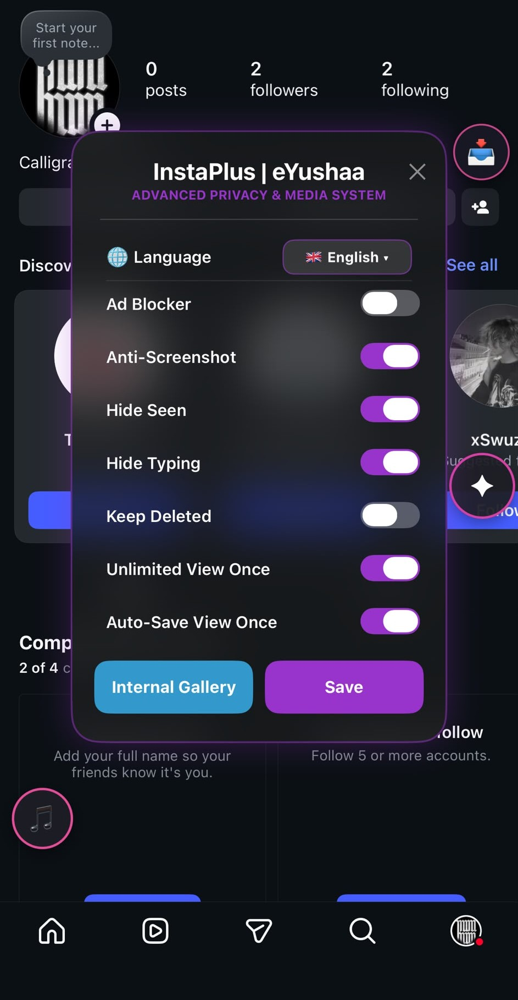
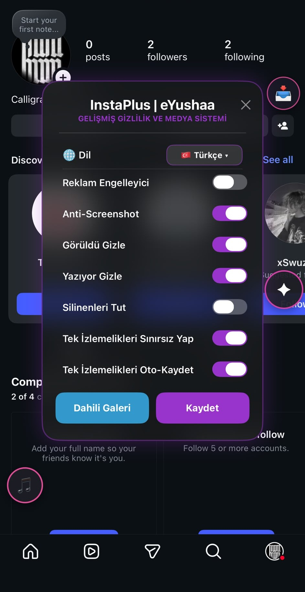

# ✨ InstaPlus

**The Ultimate Instagram Power-Up Tweak for iOS**

*Transform your Instagram experience with real-time AI voice conversion, ultimate privacy controls, and power-user features.*

---

[🇬🇧 English](#-english) • [🇹🇷 Türkçe](#-türkçe)

---

🇬🇧 <b>English</b>

## 🌟 Key Features

  

### 🎙️ AI Voice & Audio Engine
* **Real-time AI Voice Changer (RVC):** Morph your voice in Direct Messages using Retrieval-based Voice Conversion models directly embedded into Instagram's native audio engine. *(Requires **w-okada/voice-changer** as the backend server).*
* **Gallery Audio Injector:** Send any pre-recorded audio file as a live, authentic voice note in DMs.

### 📸 Media & Gallery Tools
* **Internal Gallery Pro:** 
  * Swipe-to-select and "Select All" functionality with native iOS UI.
  * Dedicated built-in media viewer with quick export and delete actions.
  * Blazing fast scrolling with background thumbnail generation.
* **Smart Story Downloader:** Download stories seamlessly with accurate username detection and precise photo/video extraction.
* **Gallery to Instant Snaps:** Send photos/videos from your camera roll as freshly captured "Instant" snaps.
* **One-Tap Media Downloader:** Save Posts, Reels, Stories, IGTV, and DM Media (Photos/Videos) directly to your Photos app or internal gallery via a custom download button.

### 👻 Privacy & Customization
* **Ultimate Ghost Mode:**
  * Read DMs without triggering "Seen" receipts.
  * Watch Stories 100% anonymously.
  * Suppress "Typing..." indicators.
* **100% Ad-Free Feed:** Block sponsored posts and story ads effortlessly.
* **Native Mod Menu:** Tweak settings, control background noise reduction, and select RVC models directly within Instagram's original Settings.

---

## 📝 Changelog

### v1.0.2
* **Full English Localization:** 
  * The Mod Menu is now fully localized.
  * Added an elegant language picker inside the Settings row to seamlessly toggle between English and Turkish.
* **Confirmation Dialog Fixes:**
  * Fixed an issue where the Double Tap and direct Like button actions bypassed the confirmation dialog on Feed and Reels.
  * Added missing confirmation layers for audio and video calls in Direct Messages.

### v1.0.1
* **Massive Gallery UI Overhaul:**
  * Implemented swipe-to-select and "Select All" functionalities.
  * Added a dedicated SingleMediaViewController with a bottom toolbar for viewing, deleting, and exporting single items natively.
  * Solved scrolling performance issues by moving video thumbnail generation to a background thread.
  * Replaced custom UI elements with native iOS SF Symbols for a premium look and feel.
* **Bug Fixes:**
  * Fixed an issue in `MediaExtractor` where story videos were occasionally saved as photos or extracted with the background feed's username.
  * Added a 3-second deduplication delay to prevent saving the same photo from DMs twice.

---

## 🚀 Installation Guide

> [!IMPORTANT]
> Make sure to follow step 3 carefully to avoid sideload detection!

1. Download the latest `.dylib` easily from the [Latest Release](https://github.com/eYushaa/InstaPlus/releases/latest) page.
2. Inject the `.dylib` into a decrypted Instagram `.ipa` using **Sideloadly**.
3. **Crucial:** Enable **Sideload Spoofer** in Sideloadly's advanced settings before installation.

---

## 🔮 Roadmap & Upcoming Features

- [x] **Dedicated RVC-Server:** A custom lightweight [RVC-Server](https://github.com/eYushaa/RVC-FK) backend will be introduced.
- [x] **Full Localization:** English UI translation for the embedded Mod Menu.
- [x] **Stability Boost:** Performance tweaks for Ghost Mode and Media Downloader.

---

🇹🇷 <b>Türkçe</b>

## 🌟 Öne Çıkan Özellikler

  

### 🎙️ Yapay Zeka Ses Teknolojisi
* **Canlı AI Ses Değiştirici (RVC):** DM sesli mesajlarında sesinizi RVC modelleriyle anında dönüştürün. Instagram'ın yerel ses motoruyla sıfır gecikmeli tam entegrasyon. *(Arka plan sunucusu olarak **w-okada/voice-changer** kullanılmasını gerektirir).*
* **Sahte Sesli Mesaj Gönderici:** Cihazınızdaki dilediğiniz ses dosyasını, o an canlı kaydedilmiş orijinal bir sesli mesaj gibi iletin.

### 📸 Medya & Galeri Araçları
* **Gelişmiş Dahili Galeri:**
  * Parmağınızı kaydırarak çoklu seçim yapma, "Tümünü Seç" ve orijinal Apple arayüzü.
  * Medyaları anında görüntülemek, film rulosuna aktarmak veya silmek için özel medya görüntüleyici.
  * Arka planda küçük resim yükleme teknolojisiyle sıfır kasma, akıcı kaydırma deneyimi.
* **Akıllı Hikaye İndirici:** Hikayeleri doğru kullanıcı adları ve orijinal formatlarıyla (fotoğraf/video ayrımıyla) kusursuzca indirin.
* **Galeriden Şipşak Fotoğraf:** Galerinizdeki medya dosyalarını sanki o saniye kameradan çekilmiş gibi "Şipşak" formatında gönderin.
* **Tek Dokunuşla Medya İndirici:** Gönderi, Reels, Hikayeler, IGTV ve DM Medyalarını (Fotoğraf/Video) özel indirme butonuyla doğrudan film rulosuna veya uygulamanın dahili galerisine kaydedin.

### 👻 Gizlilik & Özelleştirme
* **Gelişmiş Hayalet Modu (Ghost Mode):**
  * Okundu ("Görüldü") bilgisini gizleyin.
  * Hikayeleri izlerken tamamen anonim kalın.
  * "Yazıyor..." bildirimini engelleyin.
* **Sıfır Reklam Deneyimi:** Akış ve hikayelerdeki tüm sponsorlu içerikleri tamamen engelleyin.
* **Gömülü Mod Menüsü:** RVC modellerini seçmek ve gürültü engelleyici ayarlarını yapmak için Instagram'ın orijinal Ayarlar menüsüne entegre arayüz.

---

## 📝 Güncelleme Geçmişi (Changelog)

### v1.0.2
* **Tam İngilizce Dil Desteği:**
  * Mod Menüsü tamamen yerelleştirildi (İngilizce & Türkçe).
  * Ayarlar satırına İngilizce ve Türkçe arasında anında geçiş yapmanızı sağlayan şık bir dil seçici eklendi.
* **Onay Ekranı (Confirmation) Düzeltmeleri:**
  * Gönderilere doğrudan kalp butonuna basarak ve çift tıklama ile beğenme işlemlerinde onay ekranının çalışmaması sorunu giderildi.
  * DM (Mesajlar) ekranındaki sesli ve görüntülü arama başlatma butonları için eksik olan onay kalkanı eklendi.

### v1.0.1
* **Gelişmiş Galeri Arayüzü Güncellemesi:**
  * Parmağı kaydırarak çoklu seçim ve "Tümünü Seç" özellikleri eklendi.
  * Medyaları tekil olarak görüntülemek, silmek ve film rulosuna aktarmak için orijinal Apple tarzında araç çubuğuna sahip özel bir medya görüntüleyici eklendi.
  * Video küçük resimlerinin oluşturulması arka plana taşınarak kaydırma (scrolling) sırasında yaşanan kasma sorunu tamamen çözüldü.
  * Emoji tabanlı eski seçim ikonları yerini orijinal iOS ikonlarına bıraktı.
* **Hata Düzeltmeleri (Bug Fixes):**
  * `MediaExtractor` motorunda yaşanan; hikaye videolarının fotoğraf olarak kaydedilmesi ve arka plandaki akıştan yanlış kullanıcı adı çekilmesi sorunları giderildi.
  * DM'lerden fotoğraf kaydederken çift kaydetme (duplicate) hatasını önlemek için 3 saniyelik bir gecikme/koruma kalkanı eklendi.

---

## 🚀 Kurulum Adımları

> [!CAUTION]
> Uygulamanın sorunsuz çalışması için 3. adımı eksiksiz uyguladığınızdan emin olun!

1. En güncel `.dylib` dosyasını [En Son Sürüm (Latest Release)](https://github.com/eYushaa/InstaPlus/releases/latest) sayfasından kolayca indirin.
2. `.dylib` dosyasını şifresi çözülmüş (decrypted) bir Instagram `.ipa` dosyasına **Sideloadly** ile enjekte edin.
3. **Önemli:** Yükleme aşamasından önce Sideloadly gelişmiş ayarlarından **Sideload Spoofer** seçeneğini aktif edin.

---

## 🔮 Gelecek Güncellemeler (Roadmap)

- [x] **Özel RVC Sunucusu:** Projeye özel [RVC-Server](https://github.com/eYushaa/RVC-FK) backendi (arka planı) eklenecektir.
- [x] **Tam Dil Desteği:** Mod Menüsü için İngilizce arayüz seçeneği eklendi.
- [x] **Kararlılık İyileştirmeleri:** Medya İndirici ve Hayalet Modu için performans düzenlemeleri.

---

  
Crafted with ❤️ by <a href="https://github.com/eYushaa"><b>eYushaa</b></a>

